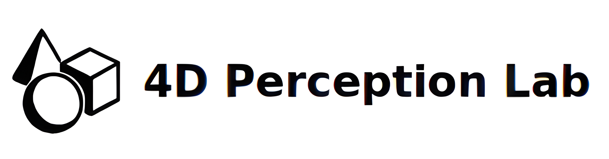
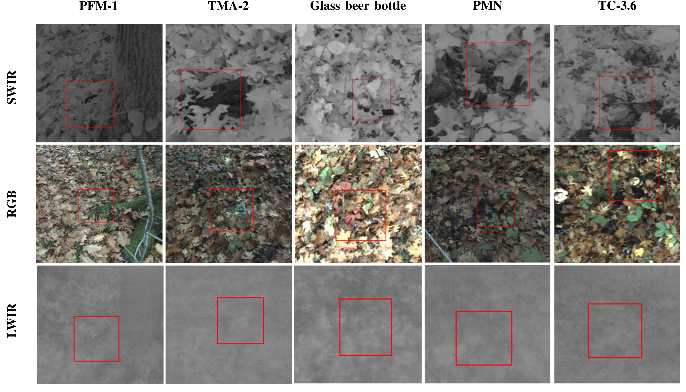
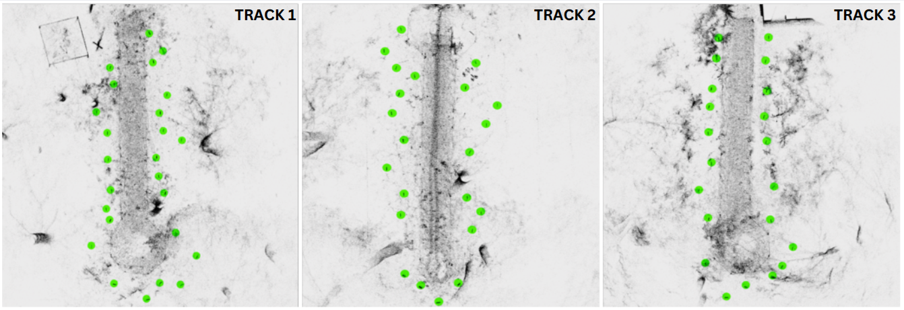

# MineInsight: A Multi-spectral Dataset for Humanitarian Demining Robotics in Off-Road Environments

  
  
  

  
  

  <b>
    <a href="https://scholar.google.com/citations?hl=en&user=3fDazuEAAAAJ">Mario Malizia</a>¹, 
    <a href="https://scholar.google.com/citations?hl=en&user=19a7OPUAAAAJ">Charles Hamesse</a>¹, 
    <a href="https://scholar.google.com/citations?hl=en&user=iyEhyh4AAAAJ">Ken Hasselmann</a>¹
  </b>

  <b>
    <a href="https://scholar.google.com/citations?hl=en&user=wYXEEZ0AAAAJ">Geert De Cubber</a>¹, 
    <a href="https://scholar.google.com/citations?hl=en&user=3VTZcT4AAAAJ">Nikolaos Tsiogkas</a>², 
    <a href="https://scholar.google.com/citations?user=QKw1XxAAAAAJ&hl=en">Eric Demeester</a>², 
    <a href="https://scholar.google.com/citations?user=OQJ8ctsAAAAJ&hl=en">Rob Haelterman</a>¹
  </b>

  ¹ Royal Military Academy of Belgium,  ² KU Leuven  

  📄 <a href="https://your-dataset-site.com">Website</a> | 📜 <a href="https://arxiv.org/abs/xxxxx">Paper</a> | 📂 <a href="https://github.com/your-repo">GitHub</a>

---
# Motivation

Landmines remain a persistent threat in conflict-affected regions, posing risks to civilians and impeding post-war recovery. Traditional demining methods are often slow, hazardous, and costly, necessitating the development of robotic solutions for safer and more efficient landmine detection. 

MineInsight is a publicly available multi-spectral dataset designed to support advancements in robotic demining and off-road navigation. It features a diverse collection of sensor data, including visible (RGB, monochrome), short-wave infrared (SWIR), long-wave infrared (LWIR), and LiDAR scans. The dataset includes dual-view sensor scans from both a UGV and its robotic arm, providing multiple viewpoints to mitigate occlusions and improve detection accuracy. 

With over <b>38,000 RGB frames</b>, <b>53,000 SWIR frames</b>, and <b>108,000 LWIR frames</b> recorded in both daylight and nighttime conditions, featuring <b>35 different targets</b> distributed along <b>3 tracks</b>, MineInsight serves as a benchmark for developing and evaluating detection algorithms. It also offers an estimation of object localization, supporting researchers in algorithm validation and performance benchmarking. 

MineInsight follows best practices from established robotic datasets and provides a valuable resource for the community to advance research in landmine detection, off-road navigation, and sensor fusion.

<!-- Line-breaker di pulizia tra il testo e l'immagine-->
  
<!-- Line-breaker di pulizia tra il testo e l'immagine-->

  

---
# Experimental Setup
This section follows the terminology and conventions outlined in the accompanying paper.  
For a more detailed understanding of the methodology and experimental design, please refer to the paper.

## Sensors overview
|  | **Platform and robotic arm**    [🔹 Clearpath Husky A200 UGV](https://clearpathrobotics.com/husky/)    [🔹 Universal Robots UR5e Robotic Arm](https://www.universal-robots.com/products/ur5e/)    <b>Platform sensor suite</b>    [🔹 Livox Mid-360 LiDAR](https://www.livoxtech.com/mid-360)    [🔹 Sevensense Core Research Module](https://github.com/sevensense-robotics/core_research_manual)    [🔹 Microstrain 3DM-GV7-AR IMU](https://www.microstrain.com/inertial-sensors/3dm-gv7-ar)     <b>Robotic arm sensor suite</b>    [🔹 Teledyne FLIR Boson 640](https://www.flir.com/products/boson/?model=20640A095&vertical=lwir&segment=oem)    [🔹 Alvium 1800 U-130 VSWIR](https://www.alliedvision.com/en/products/alvium-configurator/alvium-1800-u/130-vswir/)    [🔹 Alvium 1800 U-240](https://www.alliedvision.com/en/products/alvium-configurator/alvium-1800-u/240/)    [🔹 Livox AVIA](https://www.livoxtech.com/avia) |
|:---------------------------------------------:|:----------------------------------------------:|
## Sensors setup

 *[Mario] IMAGE WITH TF POSITIONIGN TO BE ADDED :) *

---
# Environments and sequences
The dataset was collected across **3 distinct tracks**, each designed to represent a demining scenario with varying terrain and environmental conditions. 
These tracks contain a diverse set of targets, positioned to challenge algorithms development.
The figures represents a top-view pointcloud distribution of the targets along the track.

  

---
# Targets

For each track, a **detailed inventory PDF** is available, providing the full list of targets along with their respective details.  
You can find them in the **`tracks_inventory`** folder of this repository:

  📄 <a href="tracks_inventory/track_1_targets.pdf">Track 1 Inventory</a> &nbsp;|&nbsp; 
  📄 <a href="tracks_inventory/track_2_targets.pdf">Track 2 Inventory</a> &nbsp;|&nbsp; 
  📄 <a href="tracks_inventory/track_3_targets.pdf">Track 3 Inventory</a>

Each PDF catalogs each item with:

- **ID:** Unique identifier for each target;  
- **Name:** Official name of the target;  
- **Image:** A visual reference of the object for recognition;  
- **[CAT-UXO link](https://www.cat-uxo.com/)**: Detailed explanation of the target (available only for landmines).  

---
# Calibration

[Mario] aggiungi

---
# Data

We release **2 sequences per track**, resulting in a total of **6 sequences**.  
The dataset is available in **three different formats**:

- 🗄 **ROS 2 Bags**
- 🗄 **ROS 2 Bags with Livox Custom Msg** 
- 🖼 **Images + Target Location Annotations**  

---

## ROS2 Bags Structure

Each **ROS2 Bag**, includes:

| Topic | Message Type | Description |
|-------------------------------|-----------------------------------|-----------------------------------------------------------|
| /allied_swir/image_raw/compressed | sensor_msgs/msg/CompressedImage | SWIR camera raw image |
| /allied_swir/image_raw/rectified/compressed | sensor_msgs/msg/CompressedImage | SWIR camera rectified image |
| /alphasense/cam_0/image_raw/compressed | sensor_msgs/msg/CompressedImage | Sevensense Core Greyscale camera 0 raw image |
| /alphasense/cam_0/image_raw/rectified/compressed | sensor_msgs/msg/CompressedImage | Sevensense Core Greyscale camera 0 rectified image |
| /alphasense/cam_1/image_raw/compressed | sensor_msgs/msg/CompressedImage | Sevensense Core Greyscale camera 1 raw image |
| /alphasense/cam_1/image_raw/rectified/compressed | sensor_msgs/msg/CompressedImage | Sevensense Core Greyscale camera 1 rectified image |
| /alphasense/cam_2/image_raw/compressed | sensor_msgs/msg/CompressedImage | Sevensense Core Greyscale camera 2 raw image |
| /alphasense/cam_2/image_raw/rectified/compressed | sensor_msgs/msg/CompressedImage | Sevensense Core Greyscale camera 2 rectified image |
| /alphasense/cam_3/image_raw/compressed | sensor_msgs/msg/CompressedImage | Sevensense Core Greyscale camera 3 raw image |
| /alphasense/cam_3/image_raw/rectified/compressed | sensor_msgs/msg/CompressedImage | Sevensense Core Greyscale camera 3 rectified image |
| /alphasense/cam_4/image_raw/compressed | sensor_msgs/msg/CompressedImage | Sevensense Core Greyscale camera 4 raw image |
| /alphasense/cam_4/image_raw/rectified/compressed | sensor_msgs/msg/CompressedImage | Sevensense Core Greyscale camera 4 rectified image |
| /alphasense/imu | sensor_msgs/msg/Imu | IMU data from Sevensense Core |
| /avia/livox/imu | sensor_msgs/msg/Imu | IMU data from Livox AVIA LiDAR |
| /avia/livox/lidar/pointcloud2 | sensor_msgs/msg/PointCloud2 | Point cloud data from Livox AVIA LiDAR |
| /flir/thermal/compressed | sensor_msgs/msg/CompressedImage | LWIR camera raw image |
| /flir/thermal/rectified/compressed | sensor_msgs/msg/CompressedImage | LWIR camera rectified image |
| /flir/thermal/colorized/compressed | sensor_msgs/msg/CompressedImage | LWIR camera raw image with colorized overlay |
| /flir/thermal/rectified/colorized/compressed | sensor_msgs/msg/CompressedImage | LWIR camera rectified image with colorized overlay |
| /microstrain/imu | sensor_msgs/msg/Imu | IMU data from Microstrain (internal) |
| /mid360/livox/imu | sensor_msgs/msg/Imu | IMU data from Livox Mid-360 LiDAR |
| /mid360/livox/lidar/pointcloud2 | sensor_msgs/msg/PointCloud2 | Point cloud data from Livox Mid-360 LiDAR |
| /odometry/filtered | nav_msgs/msg/Odometry | Filtered odometry data (ROS2 localization, fusion output ) |
| /odometry/wheel | nav_msgs/msg/Odometry | Wheel odometry data from UGV wheel encoder |
| /tf | tf2_msgs/msg/TFMessage | Real-time transformations between coordinate frames |
| /tf_static | tf2_msgs/msg/TFMessage | Static transformations |

If you are downloading a **ROS 2 Bag with Livox Custom Msg**, you will find the following additional topics:

| Topic | Message Type | Description |
|------------------------------|--------------------------------|------------------------------------------------|
| /avia/livox/lidar | livox_interfaces/msg/CustomMsg | Raw point cloud data from **Livox AVIA LiDAR** in custom Livox format |
| /mid360/livox/lidar | livox_ros_driver2/msg/CustomMsg | Raw point cloud data from **Livox Mid-360 LiDAR** in custom Livox format |

**Note:**
These messages include **timestamps** for each point in the point cloud scan.  
To correctly **decode and use** these messages, install the official Livox drivers:  

- **Livox AVIA** (🔗 [livox_ros2_driver](https://github.com/Livox-SDK/livox_ros2_driver))  
- **Livox Mid-360** (🔗 [livox_ros_driver2](https://github.com/Livox-SDK/livox_ros_driver2))  

For installation instructions, refer to the documentation in the respective repositories.
