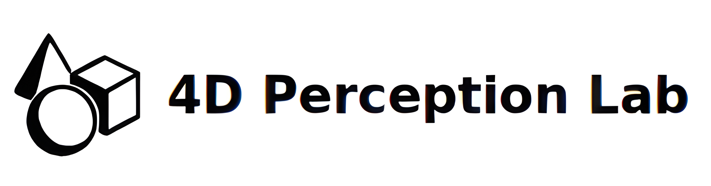

# **MineInsight: A Multi-spectral Dataset for Humanitarian Demining Robotics in Off-Road Environments**

  
  
  

  
  

  <b>
    <a href="https://scholar.google.com/citations?hl=en&user=3fDazuEAAAAJ">Mario Malizia</a>¹, 
    <a href="https://scholar.google.com/citations?hl=en&user=19a7OPUAAAAJ">Charles Hamesse</a>¹, 
    <a href="https://scholar.google.com/citations?hl=en&user=iyEhyh4AAAAJ">Ken Hasselmann</a>¹
  </b>

  <b>
    <a href="https://scholar.google.com/citations?hl=en&user=wYXEEZ0AAAAJ">Geert De Cubber</a>¹, 
    <a href="https://scholar.google.com/citations?hl=en&user=3VTZcT4AAAAJ">Nikolaos Tsiogkas</a>², 
    <a href="https://scholar.google.com/citations?user=QKw1XxAAAAAJ&hl=en">Eric Demeester</a>², 
    <a href="https://scholar.google.com/citations?user=OQJ8ctsAAAAJ&hl=en">Rob Haelterman</a>¹
  </b>

¹ Royal Military Academy of Belgium,  ² KU Leuven  

📄 [Website](https://your-dataset-site.com) | 📜 [Paper](https://arxiv.org/abs/xxxxx) | 📂 [GitHub](https://github.com/your-repo)
