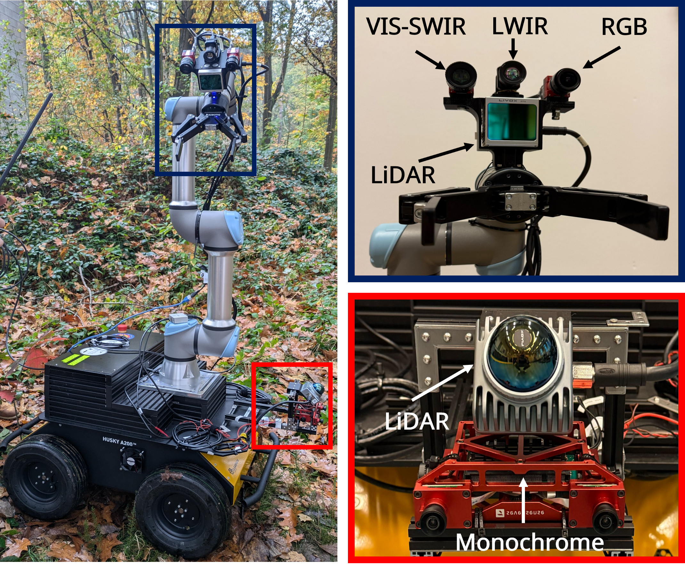

# [IEEE RA-L '25 + ICRA '26] 
# MineInsight: A Multi-sensor Dataset for Humanitarian Demining Robotics in Off-Road Environments

### 📢 News 
<div style="height:80px; overflow-y:scroll; border:1px solid #ccc; padding:10px; border-radius:5px; background-color: #f9f9f9;">
  <ul>
    <li>📦 <strong>5 Feb 2026:</strong> The <strong>Data Section</strong> has been restructured in view of the upcoming <strong>v2 update</strong>, decoupling Images, Labels, and Masks for easier access and restoring images to their original quality. Refinement of the <strong>S2 RGB</strong> labels is nearing completion.</li> </li>
    <li>📦 <strong>31 Jan 2026:</strong> Refinement completed for <strong>T1-S1</strong> and <strong>T2-S1</strong> (RGB and LWIR Reprojection), resolving bounding box inconsistencies across annotators. Work on the remaining sequences is ongoing.</li>  
    <li>🚀 <strong>31 Jan 2026:</strong> MineInsight has been accepted for presentation at <strong>ICRA 2026</strong> in Vienna!</li>
    <li>🏆 <strong>11 Dec 2025:</strong> Published on IEEE RA-L.</li>
    <li>📦 <strong>5 Jun 2025:</strong> Initial dataset release on GitHub (v1).</li>
  </ul>
</div>

---
<p align="center">
  <a href="https://rma.ac.be/en">
    
  </a>
  &nbsp;&nbsp;&nbsp;&nbsp;&nbsp;&nbsp;
  <a href="https://www.kuleuven.be/english/kuleuven">
    
  </a>
</p>

# Repository Index

- **[1]** [Motivation](#1-motivation)
- **[2]** [Experimental Setup](#2-experimental-setup)
  - [Sensors Overview](#sensors-overview)
  - [Sensors Coordinate Systems](#sensors-coordinate-systems)
- **[3]** [Environments and Sequences](#3-environments-and-sequences)
  - [Supplementary Material: Reference Data & Ground Truth](#31-supplementary-material-reference-data--ground-truth)
- **[4]** [Targets](#4-targets)
- **[5]** [Calibration](#5-calibration)
  - [Intrinsic Calibration](#intrinsic-calibration)
  - [Extrinsic Calibration](#extrinsic-calibration)
- **[6]** [Data](#6-data)
  - [ROS 2 Bags Structure](#ros-2-bags-structure)
  - [ROS 2 Bags Downloads](#ros-2-bags-downloads)
  - [Raw Images and Labels](#raw-images-and-labels)
  - [Climatology](#climatology)
  - [Track 3 RGB Camera Failure](#track-3-rgb-camera-failure)
- **[7]** [Acknowledgments](#7-acknowledgments)
- **[8]** [Citation](#8-citation)
- **[9]** [License](#9-license)
- **[10]** [Related Work](#10-related-work)
<br> 
<!-- Cleaning line breakers -->

# [1] Motivation 

Landmines remain a persistent threat in conflict-affected regions, posing risks to civilians and impeding post-war recovery. Traditional demining methods are often slow, hazardous, and costly, necessitating the development of robotic solutions for safer and more efficient landmine detection. 

MineInsight is a publicly available multi-spectral dataset designed to support advancements in robotic demining and off-road navigation. It features a diverse collection of sensor data, including visible (RGB, monochrome), short-wave infrared (VIS-SWIR), long-wave infrared (LWIR), and LiDAR scans. The dataset includes dual-view sensor scans from both a UGV and its robotic arm, providing multiple viewpoints to mitigate occlusions and improve detection accuracy. 

With over <b>38,000 RGB frames</b>, <b>53,000 VIS-SWIR frames</b>, and <b>108,000 LWIR frames</b> recorded in both daylight and nighttime conditions, featuring <b>35 different targets</b> distributed along <b>3 tracks</b>, MineInsight serves as a benchmark for developing and evaluating detection algorithms. 

<!-- Line-breaker di pulizia tra il testo e l'immagine-->
<br> 
<!-- Line-breaker di pulizia tra il testo e l'immagine-->

<p align="center" style="font-size:12px;">
  
</p>

# [2] Experimental Setup


ion follows the terminology and conventions outlined in the accompanying paper.  
For a more detailed understanding of the methodology and experimental design, please refer to the paper.

## Sensors Overview

<p align="center">  </p>


| **Platform and Robotic Arm** | **Platform Sensor Suite** | **Robotic Arm Sensor Suite** |
|-----------------------------|----------------------------|------------------------------|
| [Clearpath Husky A200 UGV](https://clearpathrobotics.com/husky/)  <br> [Universal Robots UR5e Robotic Arm](https://www.universal-robots.com/products/ur5e/)  | [Livox Mid-360 LiDAR](https://www.livoxtech.com/mid-360)  <br>[Sevensense Core Research Module](https://github.com/sevensense-robotics/core_research_manual)  <br> [Microstrain 3DM-GV7-AR IMU](https://www.microstrain.com/inertial-sensors/3dm-gv7-ar)  | [Teledyne FLIR Boson 640](https://www.flir.com/products/boson/?model=20640A095&vertical=lwir&segment=oem)  <br> [Alvium 1800 U-130 VSWIR](https://www.alliedvision.com/en/products/alvium-configurator/alvium-1800-u/130-vswir/)  <br> [Alvium 1800 U-240](https://www.alliedvision.com/en/products/alvium-configurator/alvium-1800-u/240/)  <br> [Livox AVIA](https://www.livoxtech.com/avia)  |


<br>

## Sensors Coordinate Systems

The coordinate systems (and their TF name) of all sensors in our platform are illustrated in the figure below.

> **Note:** The positions of the axis systems in the figure are approximate.  
> This visualization provides insight into the relative orientations between sensors,  
> whether in the **robotic arm sensor suite** or the **platform sensor suite**.

For the full transformation chain, refer to the following **ROS 2 topics** in the dataset:
- **`/tf_static`** → Contains static transformations between sensors.
- **`/tf`** → Contains dynamic transformations recorded during operation.


<p align="center">
  
</p>


# [3] Environments and Sequences

The dataset was collected across **3 distinct tracks**, each designed to represent a demining scenario with varying terrain and environmental conditions. 
These tracks contain a diverse set of targets, positioned to challenge algorithm development. 
The figure below represents a top-view pointcloud distribution of the targets along the tracks.

<p align="center">
  
</p>

## 3.1 Supplementary Material: Reference Data & Ground Truth

To support reproducibility and research into auto-labeling pipelines, we release the intermediate data used to generate our ground truth. This allows the community to study the "Reference Data Generation" process described in **Section IV.D** of our paper.

### 1. Reference Sequences (Raw Data)
We release the raw ROS 2 bags for the **3 Reference Sequences**. These sequences were recorded with AprilTags placed at every target location to facilitate precise pose estimation.

* **Note:** These bags are provided exactly as recorded (raw data) and have not been processed or topic-remapped like the main dataset sequences.

**Download:**
* [TRACK 1 Reference Sequence ROS 2 Bag](https://mineinsight.short.gy/I6o5dc)
* [TRACK 2 Reference Sequence ROS 2 Bag](https://mineinsight.short.gy/AQQXTH)
* [TRACK 3 Reference Sequence ROS 2 Bag](https://mineinsight.short.gy/8mgVoT)

### 2. AprilTag Ground Positions
We provide the ground truth position of each AprilTag stick relative to the reference frame map. These are released as JSON files. 

For details on how these were derived, please refer to **Section IV.D ("Reference data generation")** in the paper.

* [TRACK_1_REF.json](reference_sequences/TRACK_1_REF.json)
* [TRACK_2_REF.json](reference_sequences/TRACK_2_REF.json)
* [TRACK_3_REF.json](reference_sequences/TRACK_3_REF.json)

### 3. Automatic Labels (Pre-Refinement)
We also provide the **automatic label ground truth** generated by our pipeline before human supervision or further refinements. 

These labels were created by detecting AprilTags in the reference sequences, calculating their 3D pose via SLAM + ICP, and projecting them into the evaluation sequences (see **Section IV.D** of the paper for the full methodology).

Released as TXT files in a single folder for all tracks, these labels follow the naming convention detailed in **Section 6** of this repository to ensure temporal synchronization with the images.

* [Download AUTOMATIC LABELS](https://mineinsight.short.gy/l6T62i)

# [4] Targets

For each track, a **detailed inventory PDF** is available, providing the full list of targets along with their respective details.  
<p align="center">
  
</p>
You can find them in the **tracks inventory** folder of this repository:

<p align="center">
  📄 <a href="tracks_inventory/track_1_targets.pdf">Track 1 Inventory</a> &nbsp;|&nbsp; 
  📄 <a href="tracks_inventory/track_2_targets.pdf">Track 2 Inventory</a> &nbsp;|&nbsp; 
  📄 <a href="tracks_inventory/track_3_targets.pdf">Track 3 Inventory</a>
</p>

Each PDF catalogs each item with:

- **ID:** Unique identifier for each target;  
- **Name:** Official name of the target;  
- **Image:** A visual reference of the object for recognition;  
- **[CAT-UXO link](https://www.cat-uxo.com/)**: Detailed explanation of the target (available only for landmines).  


# [5] Calibration

The dataset includes **intrinsic** and **extrinsic** calibration files for all cameras and LiDARs.

## Intrinsic Calibration

**`intrinsics_calibration/`**  
- `lwir_camera_intrinsics.yaml` → LWIR camera  
- `rgb_camera_intrinsics.yaml` → RGB camera  
- `sevensense_cameras_intrinsics.yaml` → Sevensense grayscale cameras  
- `swir_camera_intrinsics.yaml` → VIS-SWIR camera  

<!-- Each file contains:  
- **Camera matrix** (`fx`, `fy`, `cx`, `cy`)  
- **Distortion coefficients** (and distortion model used)  
- **Image resolution**  
- **Projection matrix**   -->

## Extrinsic Calibration

**`extrinsics_calibration/`**  
- `lwir_avia_extrinsics.yaml` → LWIR ↔ Livox AVIA  
- `rgb_avia_extrinsics.yaml` → RGB ↔ Livox AVIA  
- `sevensense_mid360_extrinsics.yaml` → Sevensense ↔ Livox Mid-360  
- `swir_avia_extrinsics.yaml` → VIS-SWIR ↔ Livox AVIA  

**Note:**  
Intrinsic parameters are also included in the **extrinsics calibration files**, as they were evaluated using **raw camera images**.

# [6] Data


We release **2 sequences per track**, resulting in a total of **6 sequences**.  
The data is available in **three different formats**:

- 🗄️ **ROS 2 Bags**
- 🗄️ **ROS 2 Bags with Livox Custom Msg** 
- 📷 **Raw Images**  


## ROS 2 Bags Structure

Each **ROS 2 Bag**, includes:

<details>
  <summary>Click here to view all the topics with a detailed explaination</summary>

| Topic | Message Type | Description |
|-------------------------------|-----------------------------------|-----------------------------------------------------------|
| /allied_swir/image_raw/compressed | sensor_msgs/msg/CompressedImage | VIS-SWIR camera raw image |
| /allied_swir/image_raw/rectified/compressed | sensor_msgs/msg/CompressedImage | VIS-SWIR camera rectified image |
| /allied_rgb/image_raw/compressed | sensor_msgs/msg/CompressedImage | RGB camera raw image |
| /allied_rgb/image_raw/rectified/compressed | sensor_msgs/msg/CompressedImage | RGB camera rectified image |
| /alphasense/cam_0/image_raw/compressed | sensor_msgs/msg/CompressedImage | Sevensense Core Greyscale camera 0 raw image |
| /alphasense/cam_0/image_raw/rectified/compressed | sensor_msgs/msg/CompressedImage | Sevensense Core Greyscale camera 0 rectified image |
| /alphasense/cam_1/image_raw/compressed | sensor_msgs/msg/CompressedImage | Sevensense Core Greyscale camera 1 raw image |
| /alphasense/cam_1/image_raw/rectified/compressed | sensor_msgs/msg/CompressedImage | Sevensense Core Greyscale camera 1 rectified image |
| /alphasense/cam_2/image_raw/compressed | sensor_msgs/msg/CompressedImage | Sevensense Core Greyscale camera 2 raw image |
| /alphasense/cam_2/image_raw/rectified/compressed | sensor_msgs/msg/CompressedImage | Sevensense Core Greyscale camera 2 rectified image |
| /alphasense/cam_3/image_raw/compressed | sensor_msgs/msg/CompressedImage | Sevensense Core Greyscale camera 3 raw image |
| /alphasense/cam_3/image_raw/rectified/compressed | sensor_msgs/msg/CompressedImage | Sevensense Core Greyscale camera 3 rectified image |
| /alphasense/cam_4/image_raw/compressed | sensor_msgs/msg/CompressedImage | Sevensense Core Greyscale camera 4 raw image |
| /alphasense/cam_4/image_raw/rectified/compressed | sensor_msgs/msg/CompressedImage | Sevensense Core Greyscale camera 4 rectified image |
| /alphasense/imu | sensor_msgs/msg/Imu | IMU data from Sevensense Core |
| /avia/livox/imu | sensor_msgs/msg/Imu | IMU data from Livox AVIA LiDAR |
| /avia/livox/lidar/pointcloud2 | sensor_msgs/msg/PointCloud2 | Point cloud data from Livox AVIA LiDAR |
| /flir/thermal/compressed | sensor_msgs/msg/CompressedImage | LWIR camera raw image |
| /flir/thermal/rectified/compressed | sensor_msgs/msg/CompressedImage | LWIR camera rectified image |
| /flir/thermal/colorized/compressed | sensor_msgs/msg/CompressedImage | LWIR camera raw image with colorized overlay |
| /flir/thermal/rectified/colorized/compressed | sensor_msgs/msg/CompressedImage | LWIR camera rectified image with colorized overlay |
| /microstrain/imu | sensor_msgs/msg/Imu | IMU data from Microstrain (internal) |
| /mid360/livox/imu | sensor_msgs/msg/Imu | IMU data from Livox Mid-360 LiDAR |
| /mid360/livox/lidar/pointcloud2 | sensor_msgs/msg/PointCloud2 | Point cloud data from Livox Mid-360 LiDAR |
| /odometry/filtered | nav_msgs/msg/Odometry | Filtered odometry data (ROS 2 localization, fusion output ) |
| /odometry/wheel | nav_msgs/msg/Odometry | Wheel odometry data from UGV wheel encoder |
| /tf | tf2_msgs/msg/TFMessage | Real-time transformations between coordinate frames |
| /tf_static | tf2_msgs/msg/TFMessage | Static transformations |

</details>

If you are downloading a **ROS 2 Bag with Livox Custom Msg**, you will find the following additional topics:

| Topic | Message Type | Description |
|------------------------------|--------------------------------|------------------------------------------------|
| /avia/livox/lidar | livox_interfaces/msg/CustomMsg | Raw point cloud data from Livox AVIA LiDAR in custom Livox format |
| /mid360/livox/lidar | livox_ros_driver2/msg/CustomMsg | Raw point cloud data from Livox Mid-360 LiDAR in custom Livox format |

**Note:**
These messages include timestamps for each point in the point cloud scan.  
To correctly **decode and use** these messages, install the official Livox drivers:  

- **Livox AVIA** (🔗 [livox_ros2_driver](https://github.com/Livox-SDK/livox_ros2_driver))  
- **Livox Mid-360** (🔗 [livox_ros_driver2](https://github.com/Livox-SDK/livox_ros_driver2))  

For installation instructions, please take a look at the documentation in the respective repositories.

## ROS 2 Bags Downloads

We provide the raw data in two formats. **Standard** bags use standard ROS 2 message type (PointCloud2), while **Livox Custom Msg** bags include the raw driver data for users who need the raw polar coordinate data.

| **Track / Seq** | **Standard ROS 2 Bag** | **Livox Custom Msg Bag** |
|:---|:---|:---|
| **Track 1 - Seq 1** | [Download](https://mineinsight.short.gy/hvMRPa) `19.1 GB` | [Download](https://mineinsight.short.gy/nZkpxH) `19.6 GB` |
| **Track 1 - Seq 2** | [Download](https://mineinsight.short.gy/IHmkB6) `75.3 GB` | [Download](https://mineinsight.short.gy/LDd1Bx) `77.9 GB` |
| **Track 2 - Seq 1** | [Download](https://mineinsight.short.gy/YY9Swf) `15.1 GB` | [Download](https://mineinsight.short.gy/5IAGR4) `15.5 GB` |
| **Track 2 - Seq 2** | [Download](https://mineinsight.short.gy/pciT5I) `68.9 GB` | [Download](https://mineinsight.short.gy/0MfPRY) `71.0 GB` |
| **Track 3 - Seq 1** | [Download](https://mineinsight.short.gy/5qRJQV) `5.5 GB` | [Download](https://mineinsight.short.gy/CgLNGg) `5.9 GB` |
| **Track 3 - Seq 2** | [Download](https://mineinsight.short.gy/vfHjPD) `24.4 GB` | [Download](https://mineinsight.short.gy/aAmgvU) `26.0 GB` |


## Raw Images and Labels

Detailed explanations of file formats, directory structures, and specific annotation details (including SAM2 masks and LWIR labels) can be found in the **[Data Format & Notes](#data-format--notes)** section immediately following this table.

| **Track / Seq** | **RGB Data** | **VIS-SWIR Data** | **LWIR Data** |
| :--- | :--- | :--- | :--- |
| **Track 1 - Seq 1** | 🖼️ **[Images](https://mineinsight.short.gy/6Mvbjx)** `3.8 GB`<br>🏷️ **[Labels (v2)](https://mineinsight.short.gy/Cy5OeN)** `1.2 MB`<br>🎭 **[Masks (auto)](https://mineinsight.short.gy/WsrVwa)** `4.8 MB`| 🖼️ **[Images](https://mineinsight.short.gy/bYB63R)** `465 MB` <br>🏷️ **[Labels (v2)](https://mineinsight.short.gy/dZTjg4)** `1 MB`<br>🎭 **[Masks (auto)](https://mineinsight.short.gy/zbxef4)** `1.2 MB`| 🖼️ **[Images](https://mineinsight.short.gy/LV5XZ1)** `669 MB` <br>🏷️ **[Reproj. Labels (v2)](https://mineinsight.short.gy/Z8fqcY)** `2.5 MB`<br>🏷️ **[Auto Labels (v2)](https://mineinsight.short.gy/ZpZt6R)** `2.2 MB`|
| **Track 1 - Seq 2** | 🖼️ **[Images](https://mineinsight.short.gy/RBRY3I)** `12.0 GB` <br>🏷️ **[Labels (OLD)](https://mineinsight.short.gy/ncoHYs)**`6.5 MB`<br>🎭 *Masks Coming Soon* | 🖼️ **[Images](https://mineinsight.short.gy/rB9si6)** `4.2 GB` <br>🏷️ **[Labels (v2)](https://mineinsight.short.gy/xXIsWH)**`5.1 MB`<br>🎭 **[Masks (auto)](https://mineinsight.short.gy/8mLBb1)** `7.5 MB`| 🖼️ **[Images](https://mineinsight.short.gy/PYfYwf)** `3.0 GB` <br>🏷️ **[Reproj. Labels (OLD)](https://mineinsight.short.gy/bYpES1)** `12.2 MB`<br>🏷️ **[Auto Labels (OLD)](https://mineinsight.short.gy/7yI5TN)** `12.2 MB`|
| **Track 2 - Seq 1** | 🖼️ **[Images](https://mineinsight.short.gy/OKXGyT)** `2.8 GB` <br>🏷️ **[Labels (v2)](https://mineinsight.short.gy/yJ4vKD)** `1.2 MB`<br>🎭 **[Masks (auto)](https://mineinsight.short.gy/T1FSPQ)** `4.7 MB`| 🖼️ **[Images](https://mineinsight.short.gy/ZoJg2h)** `872 MB` <br>🏷️ **[Labels (v2)](https://mineinsight.short.gy/RVLjN6)** `1 MB`<br>🎭 **[Masks (auto)](https://mineinsight.short.gy/t6S5Sy)** `1 MB`| 🖼️ **[Images](https://mineinsight.short.gy/Tkb2ra)** `520 MB` <br>🏷️ **[Reproj. Labels (v2)](https://mineinsight.short.gy/00s2Te)** `2.3 MB`<br>🏷️ **[Auto Labels (v2)](https://mineinsight.short.gy/dAKwfC)** `2.3 MB`|
| **Track 2 - Seq 2** | 🖼️ **[Images](https://mineinsight.short.gy/mZSLV8)** `15.8 GB` <br>🏷️ **[Labels (OLD)](https://mineinsight.short.gy/5ZEVE9)** `8.7 MB`<br>🎭 *Masks Coming Soon* | 🖼️ **[Images](https://mineinsight.short.gy/DIObFu)** `2.9 GB` <br>🏷️ **[Labels (v2)](https://mineinsight.short.gy/tH7Dn7)** `4 MB`<br>🎭 **[Masks (auto)](https://mineinsight.short.gy/AHS1OK)** `6 MB`| 🖼️ **[Images](https://mineinsight.short.gy/CuoFOX)** `2.3 GB` <br>🏷️ **[Reproj. Labels (OLD)](https://mineinsight.short.gy/uvLeoo)** `9 MB`<br>🏷️ **[Auto Labels (OLD)](https://mineinsight.short.gy/D0vIEC)** `9.2 MB`|
| **Track 3 - Seq 1** | <br><p align="center">❌<br>*(Not Available)*</p> | 🖼️ **[Images](https://mineinsight.short.gy/aX73E)** `630 MB` <br>🏷️ **[Labels (v2)](https://mineinsight.short.gy/RoYk36)** `1 MB` <br>🎭 *Masks N/A* | 🖼️ **[Images](https://mineinsight.short.gy/UoD78c)** `566 MB` <br>🏷️ **[Reproj. Labels (v2)](https://mineinsight.short.gy/caHk6F)** `2 MB`<br>🏷️ **[Auto Labels (v2)](https://mineinsight.short.gy/KmOdtn)** `2.3 MB` |
| **Track 3 - Seq 2** | <br><p align="center">❌<br>*(Not Available)*</p> | 🖼️ **[Images](https://mineinsight.short.gy/ewHM2o)** `2.6 GB` <br>🏷️ **[Labels (v2)](https://mineinsight.short.gy/2kcgCx)** `3.5 MB`<br>🎭 *Masks N/A* | 🖼️ **[Images](https://mineinsight.short.gy/1XFhHc)** `2.0 GB` <br>🏷️ **[Reproj. Labels (v2)](https://mineinsight.short.gy/aT8QZL)** `7.3 MB`<br>🏷️ **[Auto Labels (v2)](https://mineinsight.short.gy/LIJ0WV)** `8 MB` |

> **Key:** 🖼️: Images | 🏷️: Annotations | 🎭: Mask (SAM2)

### 📝 Data Format & Notes

#### **1. Directory Structure**
Each archive (`.zip`) follows the naming convention: `track_(nt)_s(ns)_camera_(type).zip`.
* **(nt)** → Track number (`1, 2, 3`)
* **(ns)** → Sequence number (`1, 2`)
* **camera** → Sensor (`rgb, swir, lwir`)
* **type** → Type of resource (`images, labels, masks`) and only for LWIR (`labels_reproj, labels_auto`)


Inside, files are named: `track_(nt)_s(ns)_camera_timestampsec_timestampnanosec (.jpg / .txt)`

#### **2. Annotation Formats**
* **Bounding Boxes (YOLOv8):**
    Target positions are provided in `.txt` files:
    ```
    <class_id> <x_center> <y_center> <width> <height>
    ```
    **Classes list:** [tracks_inventory/targets_list.yaml](tracks_inventory/targets_list.yaml)
<br>

* 📢 **SAM2 Masks (Segmentation)**
We provide binary segmentation masks generated via SAM2 to assist with pixel-level analysis.
<br>

  **⚠️ Disclaimer:** These masks are **raw, auto-generated outputs** produced by **SAM2**. They were initialized using our ground-truth bounding boxes as prompts and propagated temporally across the target's lifecycle.
  These masks have **not** been human-verified or corrected.
  While many object IDs exhibit high stability (even in vegetated terrain), others may show temporal fluctuation, dimensional instability, or include background noise such as debris and leaves. **Availability:** Due to the low-light conditions on Track 3, masks are currently released **only for Track 1 & 2 (RGB and VIS-SWIR, S1 and S2).**
  <br>
  * **Format:** Binary `.png` images.
      * **How to Read:** The files are single-channel grayscale.
          * **Value 255 (White):** Target Object.
          * **Value 0 (Black):** Background.
          * *Tip: When loading (e.g., OpenCV, PIL), simply threshold > 0 to get the binary mask.*
<br>
  * **Directory Structure & Naming:**
      Masks are organized into subfolders by **Object ID**. Inside each ID folder, the mask filename corresponds to the original image timestamp, ending with the object ID.

      ```text
      track_2_s2_swir_masks/
      ├── id_2/
      │   ├── track_2_s2_swir_1730300015_687251662_id2.png
      │   ├── track_2_s2_swir_1730300015_753865168_id2.png
      │   └── ...
      ├── id_4/
      │   ├── track_2_s2_swir_1730300015_687251662_id4.png
      │   └── ...
      └── ...
      ```

  * **Naming Key:** `track_(nt)_s(ns)_(camera)_(sec)_(nanosec)_id(X).png`

 <br>

#### **⚠️ Note on Thermal (LWIR) Annotations**
Due to faint thermal signatures, direct manual annotation was unfeasible. As mentioned in the reference paper, we proceeded with reprojection with added human input. We provide **two label variants**:

**1. Reprojected Labels (`labels_reproj`)**
* **Methodology:** Manual RGB labels are reprojected into the LWIR frame using LiDAR depth. To reduce errors from sparse LiDAR or vegetation, we apply depth-gating logic to reject implausible depth jumps.
* **Pros/Cons:** High geometric consistency but dependent on the source camera's FOV. Labels may be missing if reprojection fails (ex: occlusions, depth rejection) or if the target exits the source FOV.

**2. Automatic Labels (`labels_auto`)**
* **Methodology:** Generated from the **[Automatic Labels](#3-automatic-labels-pre-refinement)** (see Section 3.1), correcting their trajectories using the locations of the manual reprojections.
* **Purpose:** Provides denser temporal coverage to fill gaps where reprojection fails. These, however, provide **larger bounding boxes** designed to indicate the general area of the target (like a ROI), rather than a tight fit.

**🛑 Track 3 Constraint:**
Since Track 3 lacks RGB data, reprojection relies solely on the **VIS-SWIR** sensor. Because the VIS-SWIR FOV is **narrower** than the Thermal FOV, you will observe more "missing labels" in Track 3 LWIR reprojections whenever targets are outside the VIS-SWIR view.

## Climatology  

We provide the **climatology data** for the two key days surrounding the test campaign:  

📄 [Climatology 29 & 30 Oct 2024.xlsx](data/Climatology%20_29_30_October_2024.xlsx)

**29 October 2024** → the day **before** the campaign, when targets were placed on the soil at around **09:00 AM local time**. 
**30 October 2024** → the day **of the campaign**, when sensor measurements were conducted.  

The full Excel file contains **minute-by-minute measurements** collected across both days. These measurements are useful for processing the thermal camera data, as they allow correlation between atmospheric and surface conditions and thermal imaging performance.  

### Parameters Provided  

The following parameters are available in the dataset (in the order of the Excel file):  

| Parameter                        | Unit     |
|----------------------------------|----------|
| Time                             | HH:MM:SS |
| Wind force (10 m)                | kt       |
| Wind gusts                       | kt       |
| Wind direction                   | ° (deg)  |
| Air temperature                  | °C       |
| T –5 cm (soil)                   | °C       |
| T –10 cm (soil)                  | °C       |
| T –20 cm (soil)                  | °C       |
| T –50 cm (soil)                  | °C       |
| Road surface temperature         | °C       |
| Grass surface temperature        | °C       |
| Dew point temperature            | °C       |
| Relative Humidity (HR)           | %        |
| Pressure                         | hPa      |
| Clouds (octas @ height @ type)   | –        |
| Total clouds                     | octas    |
| Precipitation quantity (1 min)   | mm       |
| Precipitation quantity (1 hour)  | mm       |
| Precipitation quantity (1 day)   | mm       |

### How to Use with Sequences  

To facilitate analysis, the table below shows the exact climatology time windows corresponding to each recorded sequence.  
All times refer to **30 October 2024** (campaign day).  

| Track | Sequence | Bag file start time (local) | Duration | Climatology window |
|-------|----------|-----------------------------|----------|---------------------|
| 1     | Seq 1    | 13:17:49                   | 4 min 12 s  | 13:17:49 → 13:22:01 |
| 1     | Seq 2    | 13:54:26                   | 19 min 58 s | 13:54:26 → 14:14:24 |
| 2     | Seq 1    | 15:16:35                   | 3 min 42.8 s | 15:16:35 → 15:20:17 |
| 2     | Seq 2    | 15:47:05                   | 14 min 46 s | 15:47:05 → 16:01:51 |
| 3     | Seq 1    | 17:42:19                   | 3 min 41.5 s | 17:42:19 → 17:46:00 |
| 3     | Seq 2    | 17:28:07                   | 13 min 18 s | 17:28:07 → 17:41:25 |

By aligning the timestamps of each **ROS 2 bag** with this climatology log, users can extract the environmental conditions (temperature, humidity, wind, etc.) at the exact moment of each recording.  

### Temperature Profiles (30 October 2024)

The figure below shows the **air and soil temperatures** (–5 cm, –10 cm, –20 cm, –50 cm) throughout the **campaign day (30 October 2024)**.  
**Red shaded regions** correspond to the time windows when each track sequence was recorded.  

<p align="center">
  
</p>

## Track 3 RGB Camera Failure  

During **Track 3 recordings** (30 October 2024), the **RGB camera experienced a progressive failure**.  

- The first part of the recording (starting at 17:28:07 and 17:42:19, see [Climatology section](#climatology)) already shows frames that would have been very dark, making it extremely difficult to detect any target or terrain details.  
- By the end of the sequences, the RGB feed would have been completely black, given the near-nighttime conditions. 
- This issue affects both **Sequence 1 (3 min 41.5 s)** and **Sequence 2 (13 min 18 s)**.  

We recovered the bag metadata and extracted a short video from the RGB camera illustrating the Track 3 illumination condition at the beginning of the recordings:  

<p align="center">
  
</p>

# [7] Acknowledgments  

The authors thank **Alessandra Miuccio** and **Timothée Fréville** for their support in the hardware and software design.  
They also thank **Sanne Van Hees** and **Jorick Van Kwikenborne** for their assistance in organizing the measurement campaign.
Finally, they thank the **Belgian Meteo Wing** for providing the climatology study during the days of the test campaign. 

# [8] Citation

If you use MineInsight in your own work, please cite the accompanying paper:
```
@article{11297788,
  author={Malizia, Mario and Hamesse, Charles and Hasselmann, Ken and De Cubber, Geert and Tsiogkas, Nikolaos and Demeester, Eric and Haelterman, Rob},
  journal={IEEE Robotics and Automation Letters}, 
  title={MineInsight: A Multi-Sensor Dataset for Humanitarian Demining Robotics in Off-Road Environments}, 
  year={2026},
  volume={11},
  number={2},
  pages={1650-1657},
  doi={10.1109/LRA.2025.3643265}}
```
# [9] License

This work is licensed under the **Creative Commons Attribution-NonCommercial-ShareAlike 4.0 International (CC BY-NC-SA 4.0)**.  
You are free to **share** and **adapt** this work **for non-commercial purposes**, as long as you **credit the authors** and **apply the same license** to any derivative works.

For full details, see:  
[CC BY-NC-SA 4.0 License](https://creativecommons.org/licenses/by-nc-sa/4.0/)


# [10] Related Work
If you are interested in this dataset, you may also be interested in some of the related work:

* **PFM-1 Landmine Detection in Vegetation Using Thermal Imaging with Limited Training Data.** Malizia, Mario, Ken Hasselmann, Alessandra Miuccio, Rob Haelterman, Nikolaos Tsiogkas, and Eric Demeester. 2025. 
    *Proceedings of the 25th International Conference on Control, Automation and Systems (ICCAS)*, Incheon, South Korea, pp. 1864-1869. [https://doi.org/10.23919/ICCAS66577.2025.11301116](https://doi.org/10.23919/ICCAS66577.2025.11301116)
* **Multimodal Ensemble with Verification Mechanism for Landmine Detection.** Melnykova, Nataliia, and Anna Vechirska. 2025. 
   *Science and Technology Today (Наука і техніка сьогодні)*, No. 9(50), pp. 939-948. [https://doi.org/10.52058/2786-6025-2025-9(50)-939-948](https://doi.org/10.52058/2786-6025-2025-9(50)-939-948)


<br>
<p align="center">
  
</p>
