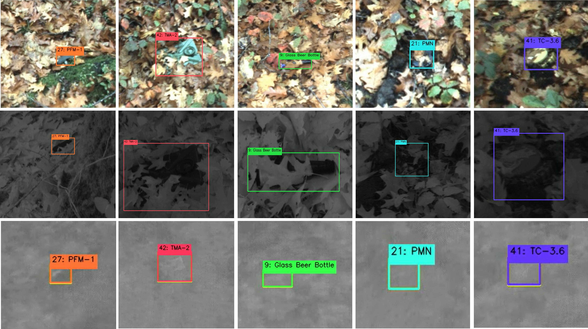
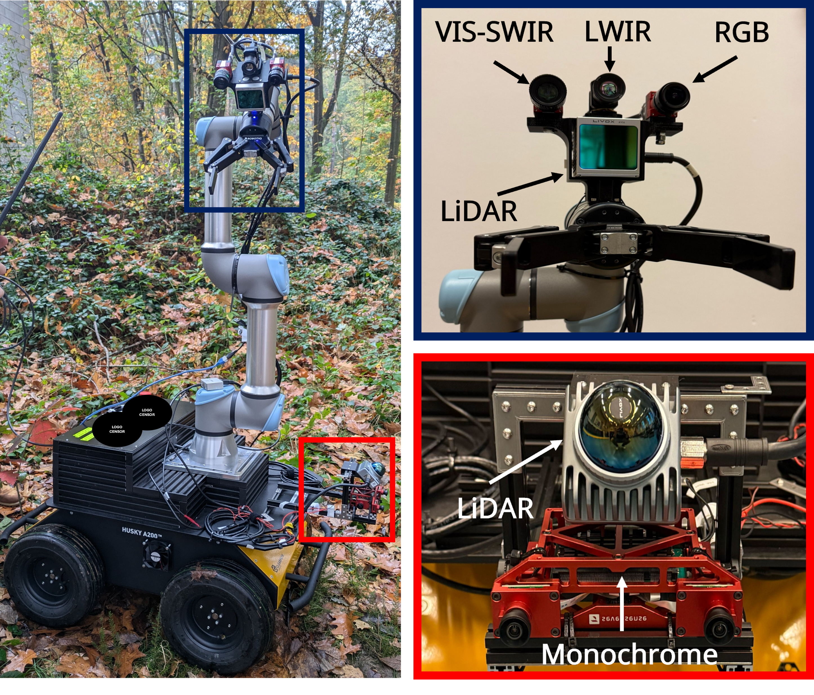
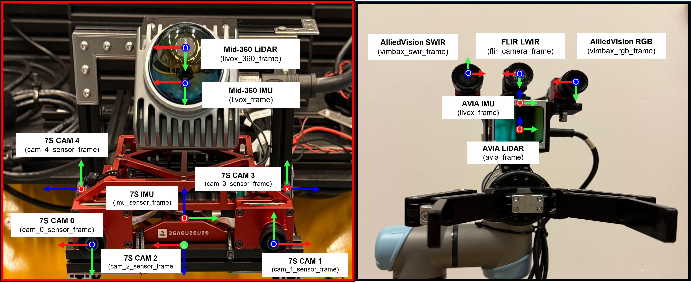
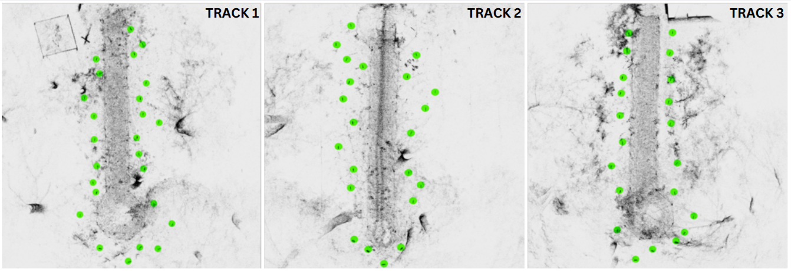
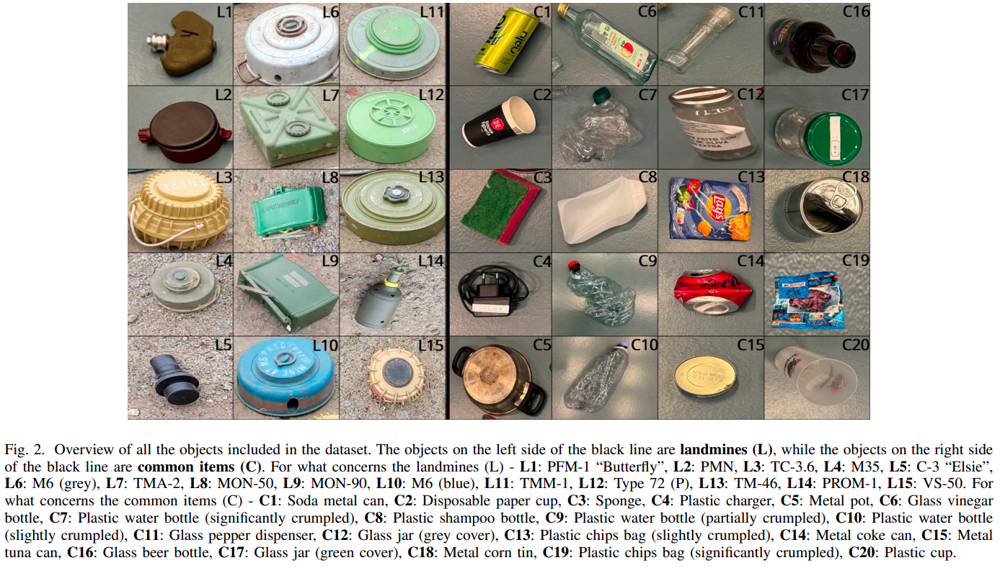
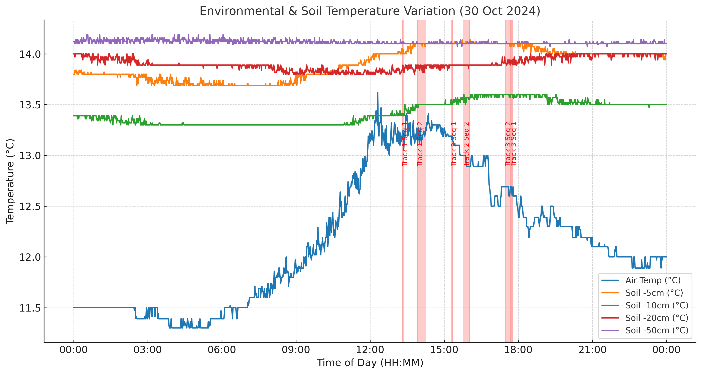
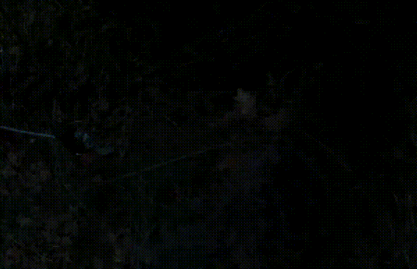

# [IEEE RA-L'25] MineInsight: A Multi-sensor Dataset for Humanitarian Demining Robotics in Off-Road Environments

### 📢 News 
<div style="height:80px; overflow-y:scroll; border:1px solid #ccc; padding:10px; border-radius:5px; background-color: #f9f9f9;">
  <ul>
    <li>🎯 <strong>21 Jan 2026:</strong> We are currently mass revising all of our VIS-SWIR and RGB labels to improve their precision </li>
    <li>📦 <strong>5 Jun 2025:</strong> Initial dataset release on GitHub.</li>
  </ul>
</div>

---
<p align="center">
  <a href="https://rma.ac.be/en">
    
  </a>
  &nbsp;&nbsp;&nbsp;&nbsp;&nbsp;&nbsp;
  <a href="https://www.kuleuven.be/english/kuleuven">
    
  </a>
</p>

# Repository Index

- **[1]** [Motivation](#1-motivation)
- **[2]** [Experimental Setup](#2-experimental-setup)
  - [Sensors Overview](#sensors-overview)
  - [Sensors Coordinate Systems](#sensors-coordinate-systems)
- **[3]** [Environments and Sequences](#3-environments-and-sequences)
- **[4]** [Targets](#4-targets)
- **[5]** [Calibration](#5-calibration)
  - [Intrinsic Calibration](#intrinsic-calibration)
  - [Extrinsic Calibration](#extrinsic-calibration)
- **[6]** [Data](#6-data)
  - [ROS 2 Bags Structure](#ros-2-bags-structure)
  - [ROS 2 Bags Downloads](#ros-2-bags-downloads)
  - [Raw Images](#raw-images)
  - [Climatology](#climatology)
  - [Track 3 RGB Camera Failure](#track-3-rgb-camera-failure)
- **[7]** [Acknowledgments](#7-acknowledgments)
- **[8]** [Citation](#8-citation)
- **[9]** [License](#9-license)
- **[10]** [Related Work](#10-related-work)
<br> 
<!-- Cleaning line breakers -->

# [1] Motivation 

Landmines remain a persistent threat in conflict-affected regions, posing risks to civilians and impeding post-war recovery. Traditional demining methods are often slow, hazardous, and costly, necessitating the development of robotic solutions for safer and more efficient landmine detection. 

MineInsight is a publicly available multi-spectral dataset designed to support advancements in robotic demining and off-road navigation. It features a diverse collection of sensor data, including visible (RGB, monochrome), short-wave infrared (VIS-SWIR), long-wave infrared (LWIR), and LiDAR scans. The dataset includes dual-view sensor scans from both a UGV and its robotic arm, providing multiple viewpoints to mitigate occlusions and improve detection accuracy. 

With over <b>38,000 RGB frames</b>, <b>53,000 VIS-SWIR frames</b>, and <b>108,000 LWIR frames</b> recorded in both daylight and nighttime conditions, featuring <b>35 different targets</b> distributed along <b>3 tracks</b>, MineInsight serves as a benchmark for developing and evaluating detection algorithms. 

<!-- Line-breaker di pulizia tra il testo e l'immagine-->
<br> 
<!-- Line-breaker di pulizia tra il testo e l'immagine-->

<p align="center" style="font-size:12px;">
  
</p>

# [2] Experimental Setup

This section follows the terminology and conventions outlined in the accompanying paper.  
For a more detailed understanding of the methodology and experimental design, please refer to the paper.

## Sensors Overview

<p align="center">  </p>


| **Platform and Robotic Arm** | **Platform Sensor Suite** | **Robotic Arm Sensor Suite** |
|-----------------------------|----------------------------|------------------------------|
| [Clearpath Husky A200 UGV](https://clearpathrobotics.com/husky/)  <br> [Universal Robots UR5e Robotic Arm](https://www.universal-robots.com/products/ur5e/)  | [Livox Mid-360 LiDAR](https://www.livoxtech.com/mid-360)  <br>[Sevensense Core Research Module](https://github.com/sevensense-robotics/core_research_manual)  <br> [Microstrain 3DM-GV7-AR IMU](https://www.microstrain.com/inertial-sensors/3dm-gv7-ar)  | [Teledyne FLIR Boson 640](https://www.flir.com/products/boson/?model=20640A095&vertical=lwir&segment=oem)  <br> [Alvium 1800 U-130 VSWIR](https://www.alliedvision.com/en/products/alvium-configurator/alvium-1800-u/130-vswir/)  <br> [Alvium 1800 U-240](https://www.alliedvision.com/en/products/alvium-configurator/alvium-1800-u/240/)  <br> [Livox AVIA](https://www.livoxtech.com/avia)  |


<br>

## Sensors Coordinate Systems

The coordinate systems (and their TF name) of all sensors in our platform are illustrated in the figure below.

> **Note:** The positions of the axis systems in the figure are approximate.  
> This visualization provides insight into the relative orientations between sensors,  
> whether in the **robotic arm sensor suite** or the **platform sensor suite**.

For the full transformation chain, refer to the following **ROS 2 topics** in the dataset:
- **`/tf_static`** → Contains static transformations between sensors.
- **`/tf`** → Contains dynamic transformations recorded during operation.


<p align="center">
  
</p>

# [3] Environments and Sequences


The dataset was collected across **3 distinct tracks**, each designed to represent a demining scenario with varying terrain and environmental conditions. 
These tracks contain a diverse set of targets, positioned to challenge algorithms development.
The figures represents a top-view pointcloud distribution of the targets along the track.

<p align="center">
  
</p>

For the sake of reproducibility, and to leave the ground-truth autolabelling and improvement as an open challenge, we also release the raw data from the **3 reference sequences** (the ones containing the AprilTag).  

Please note that these ROS2 bags have not been processed or altered — they are provided exactly as recorded, with no topic remapping applied as in the dataset.

You can download the bags from here:
- [TRACK 1 Reference Sequence ROS2 Bag](https://is.gd/fjlrLm)  
- [TRACK 2 Reference Sequence ROS2 Bag](https://is.gd/wIMDzR)  
- [TRACK 3 Reference Sequence ROS2 Bag](https://is.gd/eWoYYD)  

In addition, we also provide the output of the ground position of each AprilTag stick in the reference frame map, as described in the paper.  
These are released as JSON files, allowing users to evaluate the distances between the markers.  

You can find them here: [reference_sequences/](reference_sequences/)

- [TRACK_1_REF.json](reference_sequences/TRACK_1_REF.json)  
- [TRACK_2_REF.json](reference_sequences/TRACK_2_REF.json)  
- [TRACK_3_REF.json](reference_sequences/TRACK_3_REF.json)

# [4] Targets

For each track, a **detailed inventory PDF** is available, providing the full list of targets along with their respective details.  
<p align="center">
  
</p>
You can find them in the **`tracks_inventory`** folder of this repository:

<p align="center">
  📄 <a href="tracks_inventory/track_1_targets.pdf">Track 1 Inventory</a> &nbsp;|&nbsp; 
  📄 <a href="tracks_inventory/track_2_targets.pdf">Track 2 Inventory</a> &nbsp;|&nbsp; 
  📄 <a href="tracks_inventory/track_3_targets.pdf">Track 3 Inventory</a>
</p>

Each PDF catalogs each item with:

- **ID:** Unique identifier for each target;  
- **Name:** Official name of the target;  
- **Image:** A visual reference of the object for recognition;  
- **[CAT-UXO link](https://www.cat-uxo.com/)**: Detailed explanation of the target (available only for landmines).  


# [5] Calibration

The dataset includes **intrinsic** and **extrinsic** calibration files for all cameras and LiDARs.

## Intrinsic Calibration

**`intrinsics_calibration/`**  
- `lwir_camera_intrinsics.yaml` → LWIR camera  
- `rgb_camera_intrinsics.yaml` → RGB camera  
- `sevensense_cameras_intrinsics.yaml` → Sevensense grayscale cameras  
- `swir_camera_intrinsics.yaml` → VIS-SWIR camera  

<!-- Each file contains:  
- **Camera matrix** (`fx`, `fy`, `cx`, `cy`)  
- **Distortion coefficients** (and distortion model used)  
- **Image resolution**  
- **Projection matrix**   -->

## Extrinsic Calibration

**`extrinsics_calibration/`**  
- `lwir_avia_extrinsics.yaml` → LWIR ↔ Livox AVIA  
- `rgb_avia_extrinsics.yaml` → RGB ↔ Livox AVIA  
- `sevensense_mid360_extrinsics.yaml` → Sevensense ↔ Livox Mid-360  
- `swir_avia_extrinsics.yaml` → VIS-SWIR ↔ Livox AVIA  

**Note:**  
Intrinsic parameters are also included in the **extrinsics calibration files**, as they were evaluated using **raw camera images**.

# [6] Data


We release **2 sequences per track**, resulting in a total of **6 sequences**.  
The data is available in **three different formats**:

- 🗄 **ROS 2 Bags**
- 🗄 **ROS 2 Bags with Livox Custom Msg** 
- 🖼 **Raw Images**  


## ROS 2 Bags Structure

Each **ROS 2 Bag**, includes:

<details>
  <summary>Click here to view all the topics with a detailed explaination</summary>

| Topic | Message Type | Description |
|-------------------------------|-----------------------------------|-----------------------------------------------------------|
| /allied_swir/image_raw/compressed | sensor_msgs/msg/CompressedImage | SWIR camera raw image |
| /allied_swir/image_raw/rectified/compressed | sensor_msgs/msg/CompressedImage | SWIR camera rectified image |
| /alphasense/cam_0/image_raw/compressed | sensor_msgs/msg/CompressedImage | Sevensense Core Greyscale camera 0 raw image |
| /alphasense/cam_0/image_raw/rectified/compressed | sensor_msgs/msg/CompressedImage | Sevensense Core Greyscale camera 0 rectified image |
| /alphasense/cam_1/image_raw/compressed | sensor_msgs/msg/CompressedImage | Sevensense Core Greyscale camera 1 raw image |
| /alphasense/cam_1/image_raw/rectified/compressed | sensor_msgs/msg/CompressedImage | Sevensense Core Greyscale camera 1 rectified image |
| /alphasense/cam_2/image_raw/compressed | sensor_msgs/msg/CompressedImage | Sevensense Core Greyscale camera 2 raw image |
| /alphasense/cam_2/image_raw/rectified/compressed | sensor_msgs/msg/CompressedImage | Sevensense Core Greyscale camera 2 rectified image |
| /alphasense/cam_3/image_raw/compressed | sensor_msgs/msg/CompressedImage | Sevensense Core Greyscale camera 3 raw image |
| /alphasense/cam_3/image_raw/rectified/compressed | sensor_msgs/msg/CompressedImage | Sevensense Core Greyscale camera 3 rectified image |
| /alphasense/cam_4/image_raw/compressed | sensor_msgs/msg/CompressedImage | Sevensense Core Greyscale camera 4 raw image |
| /alphasense/cam_4/image_raw/rectified/compressed | sensor_msgs/msg/CompressedImage | Sevensense Core Greyscale camera 4 rectified image |
| /alphasense/imu | sensor_msgs/msg/Imu | IMU data from Sevensense Core |
| /avia/livox/imu | sensor_msgs/msg/Imu | IMU data from Livox AVIA LiDAR |
| /avia/livox/lidar/pointcloud2 | sensor_msgs/msg/PointCloud2 | Point cloud data from Livox AVIA LiDAR |
| /flir/thermal/compressed | sensor_msgs/msg/CompressedImage | LWIR camera raw image |
| /flir/thermal/rectified/compressed | sensor_msgs/msg/CompressedImage | LWIR camera rectified image |
| /flir/thermal/colorized/compressed | sensor_msgs/msg/CompressedImage | LWIR camera raw image with colorized overlay |
| /flir/thermal/rectified/colorized/compressed | sensor_msgs/msg/CompressedImage | LWIR camera rectified image with colorized overlay |
| /microstrain/imu | sensor_msgs/msg/Imu | IMU data from Microstrain (internal) |
| /mid360/livox/imu | sensor_msgs/msg/Imu | IMU data from Livox Mid-360 LiDAR |
| /mid360/livox/lidar/pointcloud2 | sensor_msgs/msg/PointCloud2 | Point cloud data from Livox Mid-360 LiDAR |
| /odometry/filtered | nav_msgs/msg/Odometry | Filtered odometry data (ROS 2 localization, fusion output ) |
| /odometry/wheel | nav_msgs/msg/Odometry | Wheel odometry data from UGV wheel encoder |
| /tf | tf2_msgs/msg/TFMessage | Real-time transformations between coordinate frames |
| /tf_static | tf2_msgs/msg/TFMessage | Static transformations |

</details>

If you are downloading a **ROS 2 Bag with Livox Custom Msg**, you will find the following additional topics:

| Topic | Message Type | Description |
|------------------------------|--------------------------------|------------------------------------------------|
| /avia/livox/lidar | livox_interfaces/msg/CustomMsg | Raw point cloud data from Livox AVIA LiDAR in custom Livox format |
| /mid360/livox/lidar | livox_ros_driver2/msg/CustomMsg | Raw point cloud data from Livox Mid-360 LiDAR in custom Livox format |

**Note:**
These messages include timestamps for each point in the point cloud scan.  
To correctly **decode and use** these messages, install the official Livox drivers:  

- **Livox AVIA** (🔗 [livox_ros2_driver](https://github.com/Livox-SDK/livox_ros2_driver))  
- **Livox Mid-360** (🔗 [livox_ros_driver2](https://github.com/Livox-SDK/livox_ros_driver2))  

For installation instructions, refer to the documentation in the respective repositories.

## ROS 2 Bags Downloads

You can download the datasets from the links below:

### **Track 1**
🔹 **Sequence 1**:  
   - 🗂️ [ROS 2 Bag (Standard)](https://is.gd/Q0ELIF) [19.1 GB]
   - 🗂️ [ROS 2 Bag (with Livox Custom Msg)](https://is.gd/Z34BmK) [19.6 GB]  

🔹 **Sequence 2**:  
   - 🗂️ [ROS 2 Bag (Standard)](https://is.gd/z5ly3C) [75.3 GB] 
   - 🗂️ [ROS 2 Bag (with Livox Custom Msg)](https://is.gd/d1Jyur) [77.9 GB]  


### **Track 2**
🔹 **Sequence 1**:  
   - 🗂️ [ROS 2 Bag (Standard)](https://is.gd/v0iAaG) [15.1 GB] 
   - 🗂️ [ROS 2 Bag (with Livox Custom Msg)](https://is.gd/BCYrCN) [15.5 GB]  

🔹 **Sequence 2**:  
   - 🗂️ [ROS 2 Bag (Standard)](https://is.gd/xxK8QU) [68.9 GB]  
   - 🗂️ [ROS 2 Bag (with Livox Custom Msg)](https://is.gd/vlfIWP) [71 GB]  


### **Track 3**
🔹 **Sequence 1**:  
   - 🗂️ [ROS 2 Bag (Standard)](https://is.gd/OCZkfC) [5.5 GB]  
   - 🗂️ [ROS 2 Bag (with Livox Custom Msg)](https://is.gd/70HGZI) [5.9 GB]  

🔹 **Sequence 2**:  
   - 🗂️ [ROS 2 Bag (Standard)](https://is.gd/NG4gpD) [24.4 GB]  
   - 🗂️ [ROS 2 Bag (with Livox Custom Msg)](https://is.gd/HI7MXt) [26 GB]  


## Raw Images

Each archive contains **images + 2D bounding box annotations (YOLOv8)**. After unzipping you’ll get:

| **Track / Seq** | **RGB** | **VIS-SWIR** | **LWIR** |
|---------------------|-----------|------------|------------|
| **Track 1 - Seq 1** | [track_1_s1_rgb](https://is.gd/qlkDbS) [1.5 GB]| [track_1_s1_swir](https://is.gd/NAA6u4) [465.4 MB]| [track_1_s1_lwir](https://is.gd/h2xMcF) [649.7 MB]|
| **Track 1 - Seq 2** | [track_1_s2_rgb](https://is.gd/eKoe8p) [5 GB]| [track_1_s2_swir](https://is.gd/In0r1y) [1.5 GB]| [track_1_s2_lwir](https://is.gd/J6jJ3d) [2.9 GB]|
| **Track 2 - Seq 1** | [track_2_s1_rgb](https://is.gd/gdfsJm) [1.1 GB]| [track_2_s1_swir](https://is.gd/2oudon) [332.2 MB]| [track_2_s1_lwir](https://is.gd/6hO5eM) [507.8 MB]|
| **Track 2 - Seq 2** | [track_2_s2_rgb](https://is.gd/pvDpQ2) [6.1 GB]| [track_2_s2_swir](https://is.gd/p09KcG) [1.1 GB]| [track_2_s2_lwir](https://is.gd/create.php) [2.1 GB]|
| **Track 3 - Seq 1** | <p align="center">❌</p> | [track_3_s1_swir](https://is.gd/ZD4MRM) [182.7 MB]| [track_3_s1_lwir](https://is.gd/78AOnK) [1.1 GB]|
| **Track 3 - Seq 2** | <p align="center">❌</p> | [track_3_s2_swir](https://is.gd/j7bDNG) [852.1 MB]| [track_3_s2_lwir](https://is.gd/pMr3pH) [1.9 GB]|

Each folder (.zip) follows the naming convention:

```
track_(nt)_s(ns)_camera.zip
```
Where:  
- **(nt)** → Track number (**1, 2, 3**)  
- **(ns)** → Sequence number (**1, 2**)  
- **camera** → Image type (**rgb, swir, or lwir**)  

The generic naming convention for each jpg/txt is:

```
track_(nt)_s(ns)_camera_timestampsec_timestampnanosec (.jpg / .txt)
```

The **YOLOv8 format** is used for annotations of the targets position in the .txt files.  

```
<class_id> <x_center> <y_center> <width> <height>
```

**Classes list:** [`tracks_inventory/targets_list.yaml`](tracks_inventory/targets_list.yaml)

**⚠️ Note regarding Thermal (LWIR) Annotations:**  
As detailed in the reference paper, direct manual annotation of the thermal dataset was unfeasible due to the faint or indistinct nature of thermal signatures. Consequently, LWIR labels were generated via a reprojection process from visible wavelengths (RGB or VIS-SWIR), followed by human verification. This methodology implies inherent limitations: thermal bounding boxes lack absolute dimension precision and are strictly limited to the Field of View of the source domain. Furthermore, annotations may exhibit temporal instability (jitter) reflecting variances in the original human labeling, and labels may be absent in the thermal dataset if the target was occluded or indistinct in the source RGB/SWIR sequences, even if the thermal signature remained visible.
**Specific Note on Track 3**: This limitation is significantly reflected in the labels of Track 3. In this sequence, the constant larger FOV of the RGB camera is absent. Consequently, the reconstruction had to be performed using only the limited, narrow FOV of the VIS-SWIR sensor, combined with human-supervised labeling during night conditions.

## Climatology  

We provide the **climatology data** for the two key days surrounding the test campaign:  

📄 [Climatology 29 & 30 Oct 2024.xlsx](data/Climatology%20_29_30_October_2024.xlsx)

**29 October 2024** → the day **before** the campaign, when targets were placed on the soil at around **09:00 AM local time**. 
**30 October 2024** → the day **of the campaign**, when sensor measurements were conducted.  

The full Excel file contains **minute-by-minute measurements** collected across both days. These measurements are useful for processing the thermal camera data, as they allow correlation between atmospheric and surface conditions and thermal imaging performance.  

### Parameters Provided  

The following parameters are available in the dataset (in the order of the Excel file):  

| Parameter                        | Unit     |
|----------------------------------|----------|
| Time                             | HH:MM:SS |
| Wind force (10 m)                | kt       |
| Wind gusts                       | kt       |
| Wind direction                   | ° (deg)  |
| Air temperature                  | °C       |
| T –5 cm (soil)                   | °C       |
| T –10 cm (soil)                  | °C       |
| T –20 cm (soil)                  | °C       |
| T –50 cm (soil)                  | °C       |
| Road surface temperature         | °C       |
| Grass surface temperature        | °C       |
| Dew point temperature            | °C       |
| Relative Humidity (HR)           | %        |
| Pressure                         | hPa      |
| Clouds (octas @ height @ type)   | –        |
| Total clouds                     | octas    |
| Precipitation quantity (1 min)   | mm       |
| Precipitation quantity (1 hour)  | mm       |
| Precipitation quantity (1 day)   | mm       |

### How to Use with Sequences  

To facilitate analysis, the table below shows the exact climatology time windows corresponding to each recorded sequence.  
All times refer to **30 October 2024** (campaign day).  

| Track | Sequence | Bag file start time (local) | Duration | Climatology window |
|-------|----------|-----------------------------|----------|---------------------|
| 1     | Seq 1    | 13:17:49                   | 4 min 12 s  | 13:17:49 → 13:22:01 |
| 1     | Seq 2    | 13:54:26                   | 19 min 58 s | 13:54:26 → 14:14:24 |
| 2     | Seq 1    | 15:16:35                   | 3 min 42.8 s | 15:16:35 → 15:20:17 |
| 2     | Seq 2    | 15:47:05                   | 14 min 46 s | 15:47:05 → 16:01:51 |
| 3     | Seq 1    | 17:42:19                   | 3 min 41.5 s | 17:42:19 → 17:46:00 |
| 3     | Seq 2    | 17:28:07                   | 13 min 18 s | 17:28:07 → 17:41:25 |

By aligning the timestamps of each **ROS 2 bag** with this climatology log, users can extract the environmental conditions (temperature, humidity, wind, etc.) at the exact moment of each recording.  

### Temperature Profiles (30 October 2024)

The figure below shows the **air and soil temperatures** (–5 cm, –10 cm, –20 cm, –50 cm) throughout the **campaign day (30 October 2024)**.  
**Red shaded regions** correspond to the time windows when each track sequence was recorded.  

<p align="center">
  
</p>

## Track 3 RGB Camera Failure  

During **Track 3 recordings** (30 October 2024), the **RGB camera experienced a progressive failure**.  

- The **first part of the recording** (starting at 17:28:07 and 17:42:19, see [Climatology section](#climatology)) already shows frames that **would have been very dark**, making it extremely difficult to detect any target or terrain details.  
- By the **end of the sequences**, the RGB feed **would have been completely black** given the near-nighttime conditions. 
- This issue affects both **Sequence 1 (3 min 41.5 s)** and **Sequence 2 (13 min 18 s)**.  

We recovered the bag metadata and extracted a short video from the RGB camera illustrating the Track 3 illumination condition at the beginning of the recordings:  

<p align="center">
  
</p>

# [7] Acknowledgments  

The authors thank **Alessandra Miuccio** and **Timothée Fréville** for their support in the hardware and software design.  
They also thank **Sanne Van Hees** and **Jorick Van Kwikenborne** for their assistance in organizing the measurement campaign.
Finally, they thank the **Belgian Meteo Wing** for providing the climatology study during the days of the test campaign. 

# [8] Citation

If you use MineInsight in your own work, please cite the accompanying paper:
```
@article{11297788,
  author={Malizia, Mario and Hamesse, Charles and Hasselmann, Ken and De Cubber, Geert and Tsiogkas, Nikolaos and Demeester, Eric and Haelterman, Rob},
  journal={IEEE Robotics and Automation Letters}, 
  title={MineInsight: A Multi-Sensor Dataset for Humanitarian Demining Robotics in Off-Road Environments}, 
  year={2026},
  volume={11},
  number={2},
  pages={1650-1657},
  doi={10.1109/LRA.2025.3643265}}
```
# [9] License

This work is licensed under the **Creative Commons Attribution-NonCommercial-ShareAlike 4.0 International (CC BY-NC-SA 4.0)**.  
You are free to **share** and **adapt** this work **for non-commercial purposes**, as long as you **credit the authors** and **apply the same license** to any derivative works.

For full details, see:  
[CC BY-NC-SA 4.0 License](https://creativecommons.org/licenses/by-nc-sa/4.0/)


# [10] Related Work
If you are interested in this dataset, you may also be interested in our related work:

* **PFM-1 Landmine Detection in Vegetation Using Thermal Imaging with Limited Training Data.** Malizia, Mario, Ken Hasselmann, Alessandra Miuccio, Rob Haelterman, Nikolaos Tsiogkas, and Eric Demeester. 2025. 
    *Proceedings of the 25th International Conference on Control, Automation and Systems (ICCAS)*, Incheon, South Korea, pp. 1864-1869. [https://doi.org/10.23919/ICCAS66577.2025.11301116](https://doi.org/10.23919/ICCAS66577.2025.11301116)

